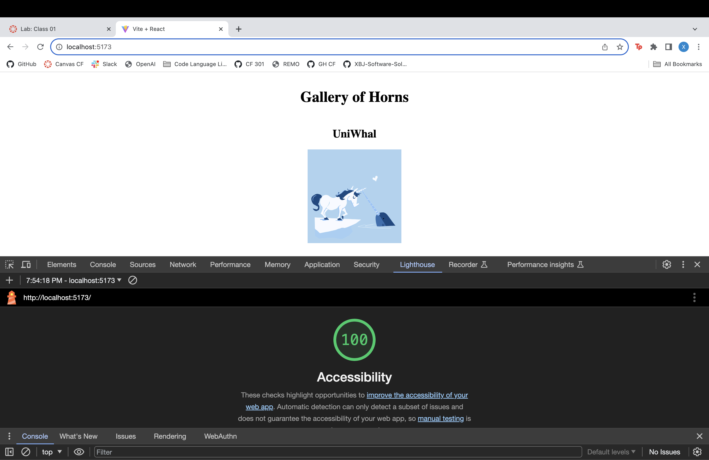
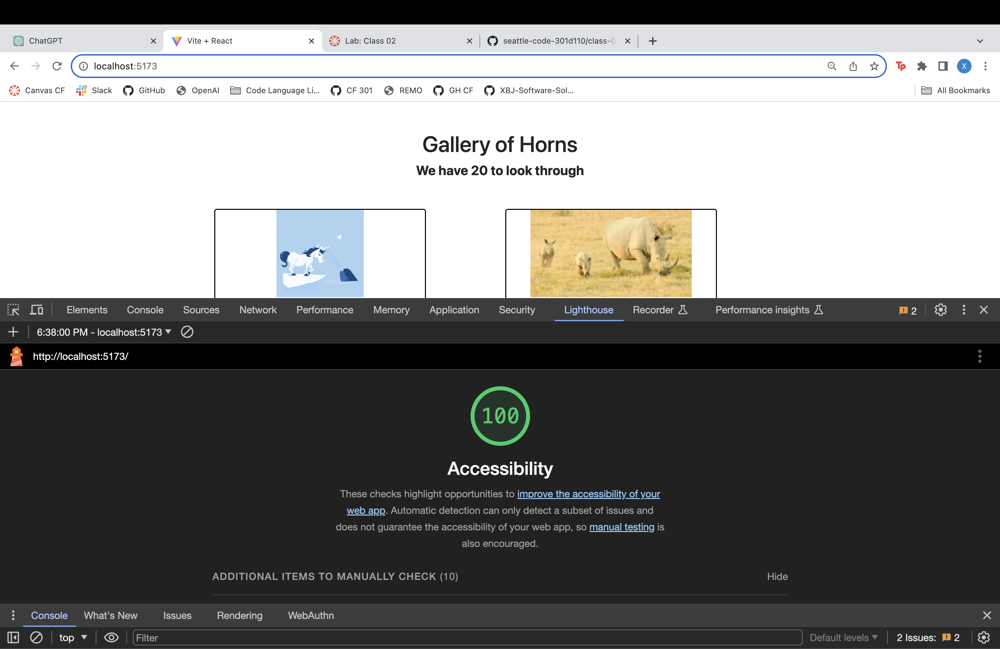
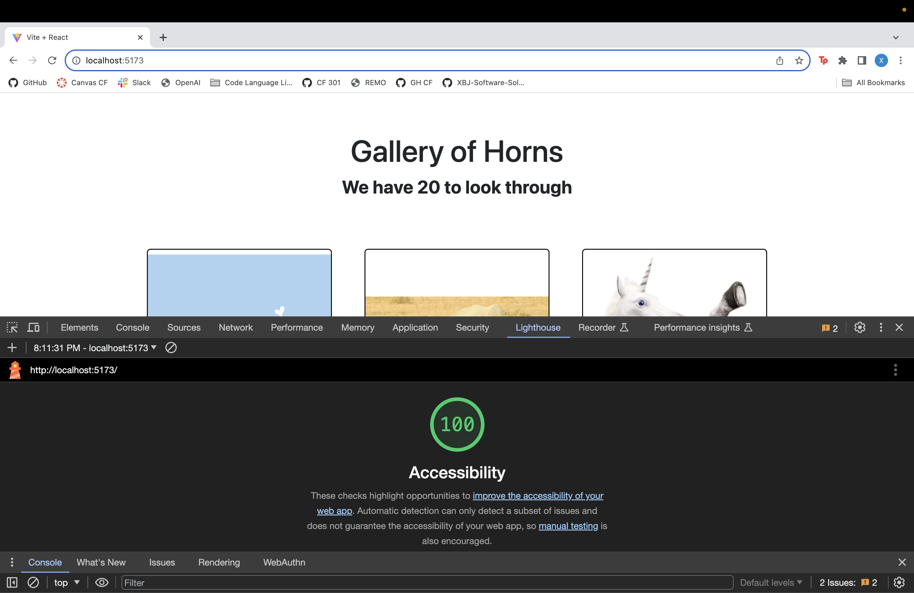
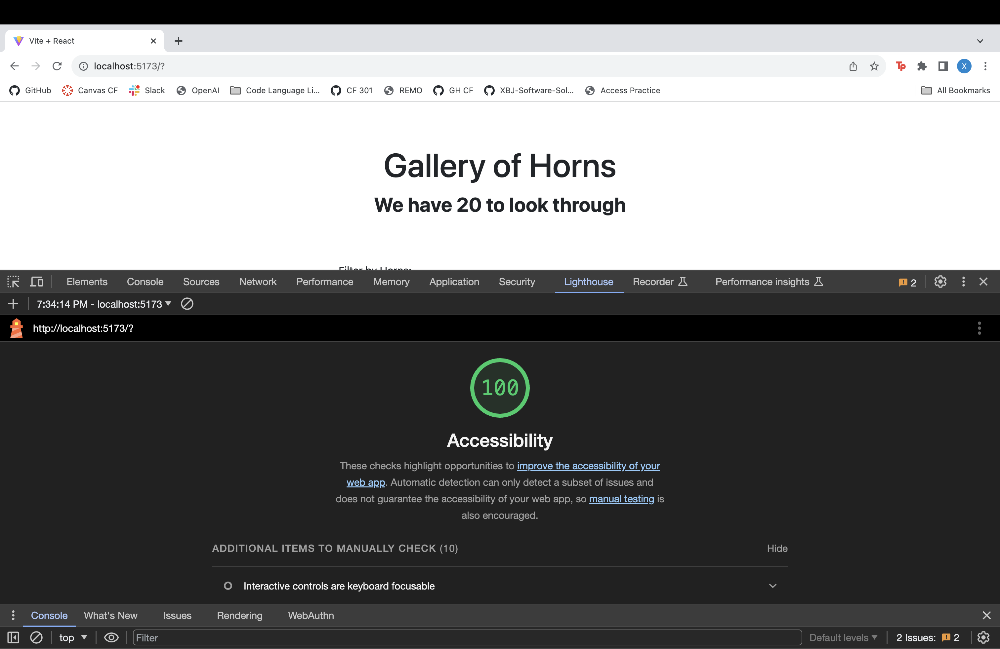

# Lab 1, 2, 3, 4, 5 

## Gallery of Horns Overview

By the end of this module, you will create an application that displays images and information of horned animals. This application will allow you to filter the images by number of horns and chose your favorite image.

For this class we will just be focusing on the component structure of the application. You will create a new React application using Vite and fill it with components. Refer to ‘Feature Tasks’ to see exactly which components to build and where to display them.

## Gallery of Horns Pt. 1

### Author: Xin Deng, Brendan Huddleston, Johnny Brackus

### Links and Resources

- [data.json](https://codefellows.github.io/code-301-guide/curriculum/class-02/lab/assets/data.json)

### Lighthouse Accessibility Report Score

### Reflections and Comments

1. How much time spent on lab?

I spent four hours on this, but an hour of it was figuring out how to set up the lab with the npm and repo which we did not go over in class and the people I was working with had trouble too. Then two hours of it was figuring out why the live was crashing even though I tried to copy someone elses work word for word to test it out and it was still having crashing issues. I had to quit npm and run it again every time I made changes which was weird. Rewriting my own code took an hour. 

## Gallery of Horns Pt. 2

### Author: Xin Deng, Kyle Aleman

- He helped me figure out row needed to be in gallery and col/card was used in hornedbeast. Although, we don't quite understand how.

### Time Estimate

1. Number and name of feature: Feature #1: Display Images
    - Estimate of time needed to complete: 2 hrs
    - Start time: 1:48pm
    - Finish time: 2:47pm
    - Actual time needed to complete: 1 hr

1. Number and name of feature: Feature #2: Allow Users to Favorite Individual Beasts
    - Estimate of time needed to complete: 3 hrs
    - Start time: 2:47pm
    - Finish time: 3:02pm
    - Actual time needed to complete: 15 minutes

1. Number and name of feature: Feature 3: Bootstrap
    - Estimate of time needed to complete: 3 hrs
    - Start time: 3:03pm
    - Finish time: 6:39pm
    - Actual time needed to complete: 3 and a half hrs

### Links and Resources

- [data.json](https://codefellows.github.io/code-301-guide/curriculum/class-02/lab/assets/data.json)

### Lighthouse Accessibility Report Score

### Reflections and Comments

1. A question within the context of the lab assignment
    - I really don't understand how things in bootstrap work the way they do. Also I wasn't sure but I did a lot of inline CSS because that's what John did.
1. An observation about the lab assignment, or related ‘Ah-hah!’ moment
    - Once I made the props list in the gallery using props for all the files made things so much easier.
1. How long you spent working on this assignment
    - Almost 5 hours 

## Gallery of Horns Pt. 3

### Author: Xin Deng, Ekow Yawson, ChatGpt, Grid on React Bootstrap

- My images and modal weren't rendering, he helped me figure out the onClick in the card img was wrong 
- ChatGPT helped with a lot of formatting and scoping issues 

### Time Estimate

1. Number and name of feature: Feature #1: Display a modal
    - Estimate of time needed to complete: 6 hrs
    - Start time: 1:34pm
    - Finish time: 8:13pm
    - Actual time needed to complete: 7 hrs

### Links and Resources

- [data.json](https://codefellows.github.io/code-301-guide/curriculum/class-02/lab/assets/data.json)

### Lighthouse Accessibility Report Score

### Reflections and Comments

1. A question within the context of the lab assignment
    - I don't understand scope of having state in app still and how to make sure everything is link to each other. 
1. An observation about the lab assignment, or related ‘Ah-hah!’ moment
    - Is there something we're not getting in terms of bootstrap CSS because it feels like it's not allowing changes easily.
1. How long you spent working on this assignment
    - Seven hrs which is an hour longer then estimated because the directions on the lab were confusing and the TA and john were telling me different things of where to put useState. 

## Gallery of Horns Pt. 4

### Author: Xin Deng, Brandon Mizutani, Kyle ALeman, ChatGpt, Form on React Bootstrap

- Brandon helped with scope issues
- Kyle also helped with function passing 
- ChatGPT helped with a lot of formatting and scoping issues 

### Time Estimate

1. Number and name of feature: Feature #1: Display a modal
    - Estimate of time needed to complete: 9 hrs
    - Start time: 2:15pm
    - Finish time: 7:36pm
    - Actual time needed to complete: 6 hrs

### Links and Resources

- [data.json](https://codefellows.github.io/code-301-guide/curriculum/class-02/lab/assets/data.json)

### Lighthouse Accessibility Report Score

### Reflections and Comments

1. A question within the context of the lab assignment
    - I do not understand bootstrap CSS and also spread and filter all that well.
1. An observation about the lab assignment, or related ‘Ah-hah!’ moment
    - For some reason in my modal the title and description showed up but the image didn't, Kyle helped me figured out because what I named the image was only in the galley and what I name in gallery for title and description were the same names in the useState.
1. How long you spent working on this assignment
    - Six hours a lot of the confusion was from the filter and handle form still, I kinda get passing because making components and just using app to pass down is much easier than the whole app>gallery>hornedbeast mess.

